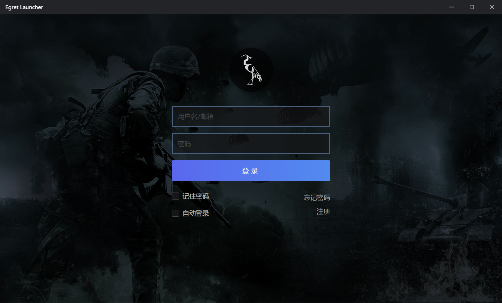
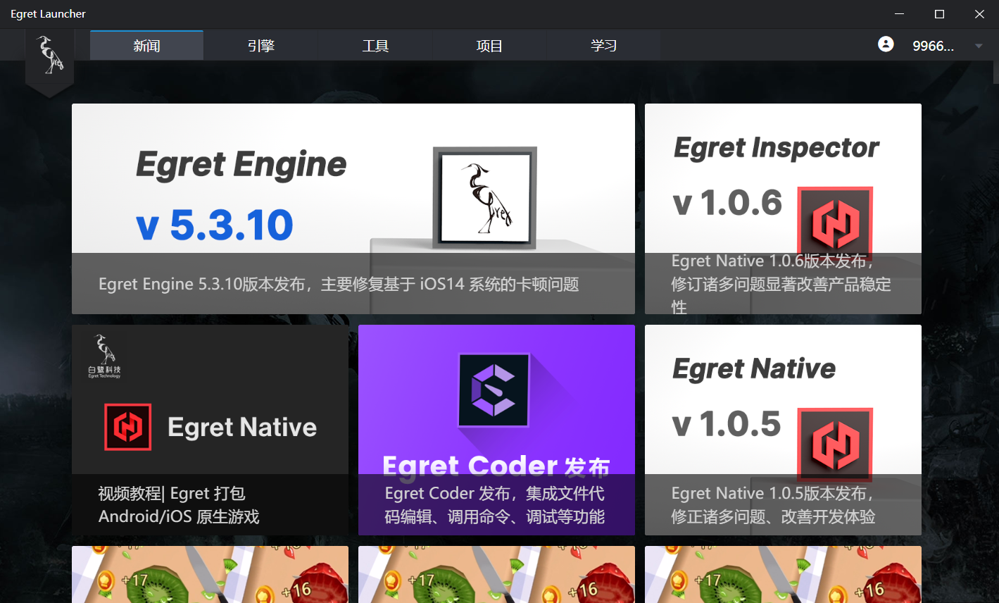
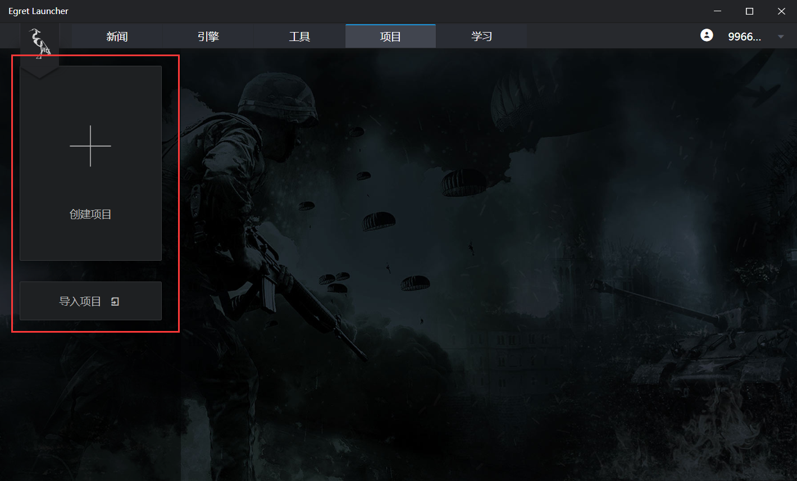
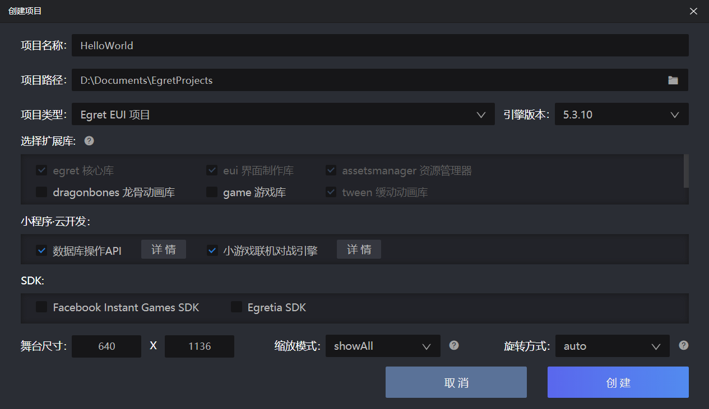
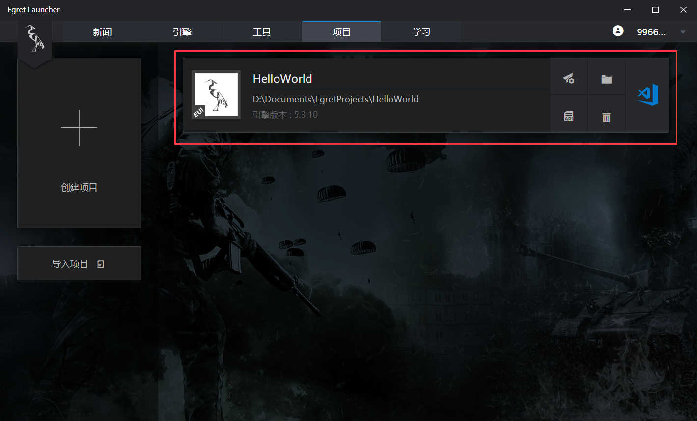
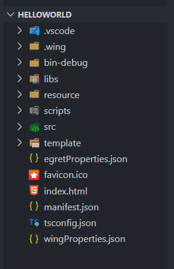
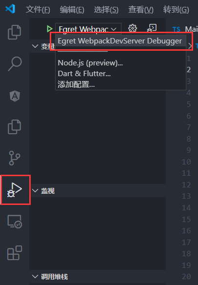

# Hello World

### 安装引擎

下载[Egret Laucher](https://docs.egret.com/engine),(可参考：[安装与部署]())。

登陆成功后会显示Egret Launcher主界面。

### 创建项目
1、点击菜单 `项目` -> `创建项目` 来创建项目，如下图。

也可以选择 `导入项目` 来导入已有项目。

2、在弹出的新建项目面板中，设置项目的基本配置，如下图。

- 项目名称：当前项目的名称，如 HelloWorld
- 项目路径：该项目所存放的文件路径。
- 项目类型：该项目的项目类型，如 Egret 游戏项目 ， Egret EUI 项目。
- 引擎版本：当前项目所使用的 Egret 的版本。
- 选择扩展库：项目中需要使用的系统库。更多关于扩展库选择的介绍可以参考：[扩展库简介]()
- 缩放方式：屏幕的适配方式，这里选择showALL模式。更多关于缩放模式的介绍可以参考：[屏幕适配]()
- 旋转方式：屏幕的旋转模式，这里选择auto模式。更多关于旋转设置的介绍可以参考：[屏幕适配]()

点击 `创建` ，创建Hello World项目。

项目可以直接在Egret Launcher 中进行打开，管理。

### 项目结构

在VScode左侧，可看到当前项目的目录结构：

各文件夹功能说明

- .vscode：包括 Egret 项目的任务配置文件和启动配置文件。
- .wing：包括 Egret 项目的任务配置文件和启动配置文件。（已废弃）
- wingProperties.json：Egret Wing 项目配置文件。（已废弃）
- bin-debug：项目调试时，所产生的文件存放于此目录。
- libs：库文件，包括 Egret 核心库和其他扩展库存放于此目录。
- resource：项目资源文件存放于此目录。
- scripts：项目构建和发布时需要用到的脚本文件存放在此目录。
- src：项目代码文件存放于此目录。
- template：项目模板文件存放于此目录。
- egretProperties.json：项目的配置文件。具体的配置说明可以参考：[EgretProperties说明]()
- index.html：入口文件。具体的配置说明可以参考：[入口文件说明]()
- manifest.json：网页清单文件。
- tsconfig.json：typescript 编译配置文件。

### 运行项目

在侧栏中的 `运行` 面板选择 `Egret WebpackDevServer Debugger`，如下图。

然后按F5运行项目，如下图。

